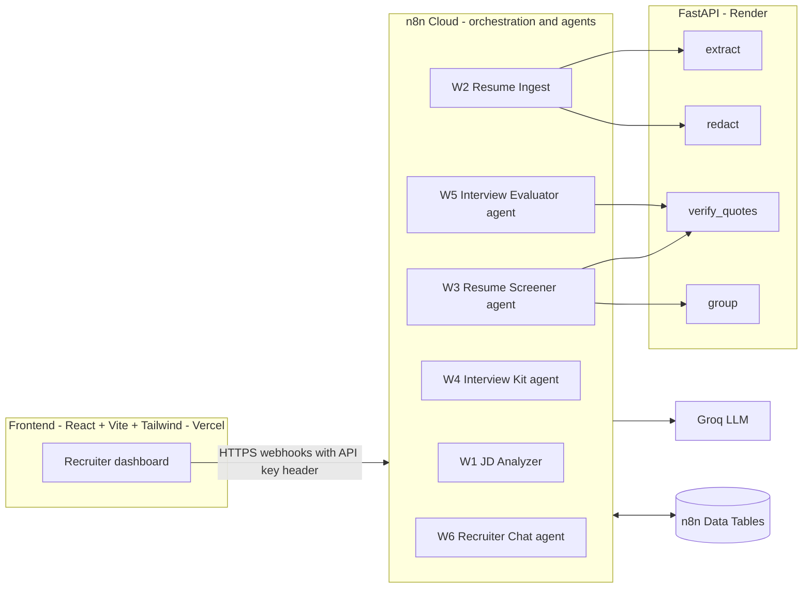
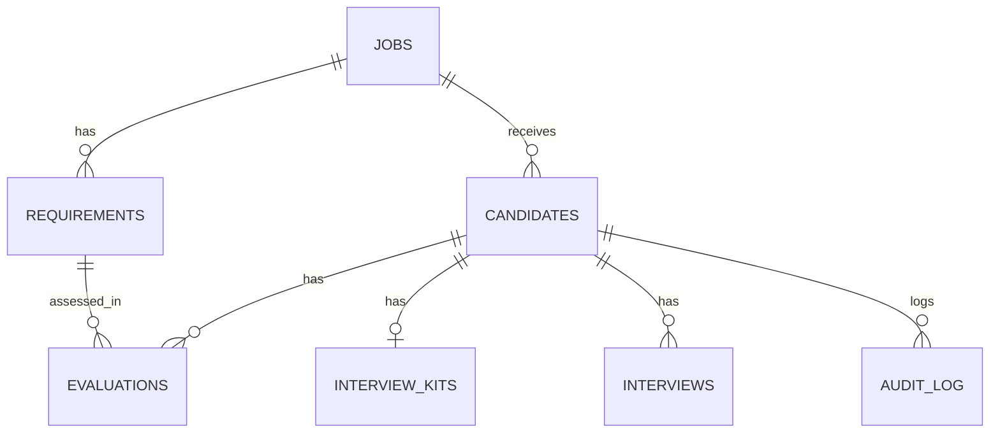
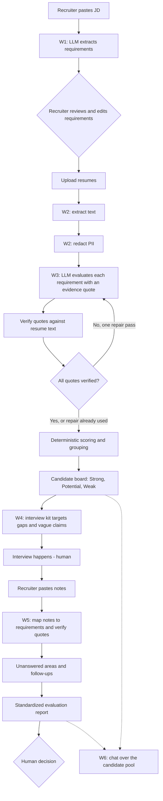
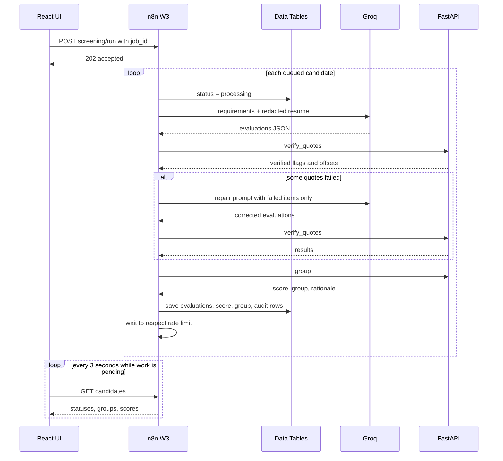
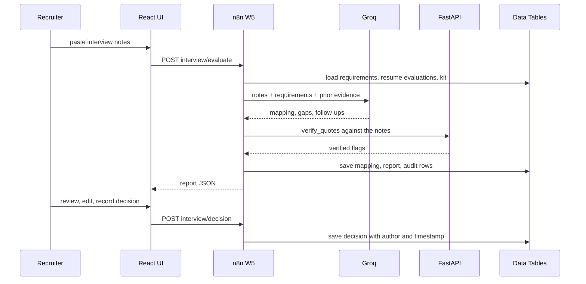
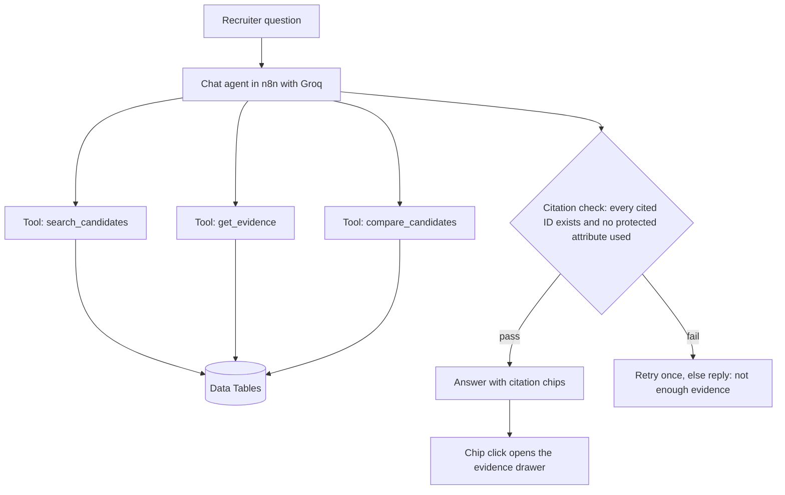
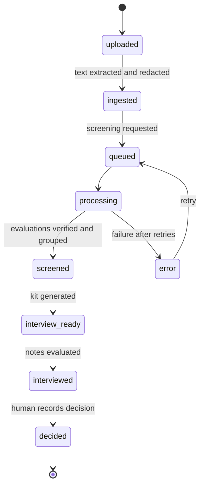
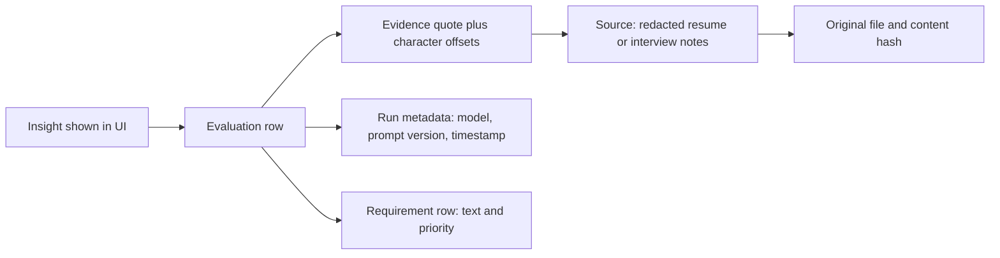

# HireFlow: PRD, TRD and Flow Architecture

**AI Candidate Screening and Interview Intelligence Agent**
Agentic AI Hackathon '26 (Product Space) · Problem Statement 3 · Solo build

| | |
|---|---|
| Version | 1.0 |
| Date | 19 Sep 2026 |
| Submission deadline | 20 Sep 2026, 11:59 PM IST (no edits after submitting) |
| Builder | Solo |

**Contents:** 0. Decisions at a glance · 1. PRD · 2. TRD · 3. Flow architecture · 4. Build plan and checklists · Appendices

---

## 0. Decisions at a glance

| Area | Decision | Why |
|---|---|---|
| Orchestration and agents | **n8n Cloud** | Clear agentic flow for the AI score, plus the optional JSON and live link deliverables |
| LLM | **Groq**, a Llama 3.3 70B class model (confirm the current model name in Groq's list) | Fast, free tier; larger models are needed for reliable JSON and tool calling |
| Helper API | **FastAPI on Render** | Things n8n does badly: PDF/DOCX parsing, PII redaction, fuzzy quote verification, deterministic scoring |
| Frontend | **React + Vite + TypeScript + Tailwind on Vercel** | Polished UI for the 20% UX score, public link for judges |
| Storage | **n8n Data Tables** (fallback: Supabase free tier) | No extra service to run; confirm Data Tables are on your plan, else switch |
| Scoring and grouping | **Deterministic code**; the LLM only extracts evidence | Not a black box, reproducible, explainable |
| Evidence | **Verbatim quote + character offsets, verified in code** | Makes the audit trail provable and blocks hallucinated evidence |
| Fairness | **Blind screening**: PII redacted before the LLM sees a resume | Directly addresses the sensitivity of hiring AI |
| Decisions | **Human only**; decision fields are blank by default | The problem statement says humans stay at the centre |
| Processing | **Async, sequential, frontend polls** | Respects Groq rate limits and n8n webhook timeouts |

---

# PART 1: PRODUCT REQUIREMENTS (PRD)

## 1.1 Product summary

HireFlow is an AI-assisted recruitment workspace. A recruiter uploads a job description and a stack of resumes. HireFlow turns the JD into explicit requirements, finds **quoted evidence** in each resume for every requirement, groups candidates transparently, prepares targeted interview questions, converts interview notes into a standardized report, and lets the recruiter interrogate the whole pool in plain English. Every insight links back to the exact source text that produced it.

**One-line pitch:** *Evidence-first, bias-aware hiring intelligence where every AI insight is traceable and every decision stays human.*

## 1.2 Problem

Recruiters read large volumes of resumes for each role. Key information is buried across resumes, portfolios and notes. Comparisons between candidates are inconsistent, interviewers spend time preparing instead of listening, and it is hard to later explain why a candidate was shortlisted.

## 1.3 Goals and non-goals

**Goals**
1. Cut screening time by turning resumes into requirement-by-requirement evidence maps.
2. Make every AI claim verifiable through a source quote.
3. Reduce prep time with interview questions targeted at each candidate's gaps and vague claims.
4. Standardize interview evaluation across interviewers.
5. Support fair screening through blind (redacted) evaluation.
6. Cover every bullet of Problem Statement 3 with a working end-to-end flow.

**Non-goals**
- Automated hire/reject decisions or ranking by "culture fit".
- Scoring on protected attributes or their proxies.
- Sourcing candidates, scheduling, ATS integration, or OCR for scanned resumes (MVP).
- Production-grade multi-tenant auth.

## 1.4 Users

| Persona | Needs | Key screens |
|---|---|---|
| **Recruiter (primary)** | Shortlist fast, justify shortlists, query the pool | Job setup, candidate board, candidate detail, compare, chat, audit |
| **Interviewer / hiring manager** | Know what to probe, capture notes, produce a consistent report | Interview kit, notes and report |
| **Hackathon judge (secondary)** | Understand the value in 3 minutes | Demo mode, clean UI, visible safeguards |

## 1.5 Product principles

1. **Evidence before opinion.** No status without a quote; unverifiable quotes are downgraded automatically.
2. **Human decides.** AI suggests evidence and questions. Decision fields belong to the recruiter.
3. **Fair by design.** The screening model never sees names, gender cues, contact details, age or institution names.
4. **Transparent scoring.** Grouping rules are visible and computed in code, not by the LLM.
5. **Show uncertainty.** "Unclear" and "needs validation" are first-class results, not hidden.

## 1.6 Core user journey

| Stage | Recruiter action | System response |
|---|---|---|
| 1. Define role | Pastes or uploads JD | Extracts requirements (must-have or nice-to-have); recruiter edits them |
| 2. Load candidates | Uploads resumes | Extracts text, redacts PII, queues screening |
| 3. Screen | Watches the board fill | Per-requirement evidence, verified quotes, score, group, summary |
| 4. Review | Opens a candidate, clicks any evidence chip | Sees the highlighted source snippet and reasoning |
| 5. Prepare | Opens interview kit | Targeted questions, follow-up probes, "what good looks like" |
| 6. Interview | Pastes notes afterwards | Notes mapped to requirements, unanswered areas flagged, follow-ups suggested |
| 7. Report | Reviews standardized report | Editable report; decision fields blank until recruiter fills them |
| 8. Ask | Chats with the pool | Answers with clickable citations |

## 1.7 Functional requirements and traceability

Priority: **P0** core demo path (build today) · **P1** completes the problem statement (tomorrow morning) · **P2** stretch.

| ID | Requirement | Covers Problem Statement 3 bullet | Priority |
|---|---|---|---|
| FR-01 | Upload or paste a job description; extract structured requirements (text, must/nice, category); recruiter can edit | Upload JD and resumes | P0 |
| FR-02 | Upload multiple resumes (PDF, DOCX, TXT); extract text | Upload JD and resumes | P0 |
| FR-03 | Extract skills, experience, projects, qualifications into a structured profile | Extract relevant skills, experience, projects, qualifications | P0 |
| FR-04 | Map each requirement to a status (met / partial / unclear / missing) with evidence quote and reasoning | Map candidate experience against job requirements | P0 |
| FR-05 | Flag missing or unclear information as **needs validation** with a validation note | Identify missing or unclear information | P0 |
| FR-06 | Group candidates (Strong / Potential / Weak) using a deterministic, visible rule | Group candidates | P0 |
| FR-07 | Generate a structured candidate summary card | Structured candidate summaries | P0 |
| FR-08 | Generate role-specific interview questions from the candidate's gaps and strengths | Role-specific interview questions | P1 |
| FR-09 | Generate follow-up probes for vague claims, and after interview answers that lack depth | Follow-up questions | P1 |
| FR-10 | Summarize pasted interview notes and map evidence to requirements | Summarize notes, map evidence | P1 |
| FR-11 | Identify requirements not covered in the interview | Identify unanswered evaluation areas | P1 |
| FR-12 | Generate a standardized interview evaluation report (human rating and decision fields blank) | Standardized report | P1 |
| FR-13 | Natural-language chat over the candidate pool with citations | Query the pool in natural language | P1 |
| FR-14 | Audit trail: every insight stores its sources, model, prompt version, timestamp | Audit trail | P0 (basic) / P1 (UI) |
| FR-15 | Blind screening: redact PII before any LLM call | Differentiator | P0 |
| FR-16 | Quote verification plus a one-shot **verify-and-repair** loop | Differentiator | P0 |
| FR-17 | Side-by-side candidate comparison | Differentiator | P2 |
| FR-18 | Human decision gate (decision, note, author, timestamp) | Keeps decisions human | P1 |
| FR-19 | Demo mode with pre-seeded results so the demo never depends on live APIs | Reliability | P1 |
| FR-20 | Export the evaluation report (print to PDF) | Polish | P2 |

## 1.8 Non-functional requirements

| Category | Requirement |
|---|---|
| Performance targets | JD analysis under 15 s · 6 resumes screened under 3 min end to end · chat answer under 8 s |
| Reliability | Demo mode; retries with backoff on Groq 429/5xx; pipeline continues if one resume fails |
| Explainability | Every status shows quote, reasoning, and source span |
| Fairness | Redaction before LLM; prohibited-signal instruction in every prompt; fairness statement shown in UI and demo |
| Privacy | Synthetic or consented data only; "Purge data" action; no real candidate PII in the demo |
| Usability | Works on a laptop browser; states for loading, empty, error; keyboard-accessible evidence drawer |
| Portability | n8n workflow JSON exported without secrets; repo runnable by another person from the README |

## 1.9 Success metrics and scoring alignment

| Scoring area | Weight | How this project earns it |
|---|---|---|
| Problem understanding | 15% | Day 1 post and demo open with the recruiter pain, principles, and traceability to all 13 bullets |
| Prototype quality and UX | 20% | React dashboard: board, evidence drawer, report view, demo mode |
| AI integration | 25% | Four agents, structured output, tool-using chat agent, verify-and-repair loop, code-enforced guardrails |
| LinkedIn content and engagement | 25% | Two posts with architecture, fairness angle, and screenshots; tag Product Space |
| Innovation and creativity | 15% | Quote verification, blind screening, needs-validation to interview-question loop |

**Quality metrics (shown in the demo or a post):** quote verification pass rate on first attempt, agreement with a hand-labelled golden set of 6 resumes (see Appendix A), share of insights with a verified source (target 100%).

## 1.10 Scope and cut line

If time runs short, cut in this order: FR-20, FR-17, tool-calling in chat (fall back to retrieve-then-answer), FR-09 post-interview follow-ups. **Never cut:** FR-01 to FR-07, FR-14, FR-15, FR-16, and FR-19 (demo safety net).

## 1.11 Risks and mitigations

| Risk | Impact | Mitigation |
|---|---|---|
| Groq free-tier rate limits | Screening stalls mid-demo | Sequential processing, Wait node, small prompts, demo mode |
| LLM invents evidence | Destroys trust | Code verification, downgrade to unclear, one repair pass |
| Malformed JSON | Workflow errors | Structured Output Parser with auto-fix, low temperature, schema validation |
| Render cold start | First call takes 30 to 60 s | Warm the service before demos; a scheduled ping to `/health` |
| n8n Cloud trial or execution limits | Workflows stop | Keep executions lean; export JSON early and often |
| Redaction is imperfect | PII or proxies leak | State plainly that it is best-effort; use synthetic data; regex plus heuristics plus optional NER |
| Scope too large for solo 2 days | Incomplete demo | P0/P1/P2 plan and cut line above |
| Regulatory sensitivity of hiring AI (for example the EU AI Act treats recruitment AI as high-risk) | Judge concern | Human-in-the-loop, explainability, audit trail, no automated decisions, said explicitly in the demo |

## 1.12 Future work (mention in the demo close)

ATS integration, OCR for scanned resumes, bias audit dashboard, multi-interviewer calibration, calendar scheduling, role-based access, a proper database.

---

# PART 2: TECHNICAL REQUIREMENTS (TRD)

## 2.1 Technology stack

| Layer | Technology | Notes |
|---|---|---|
| Frontend | React 18, Vite, TypeScript, Tailwind CSS, React Router, TanStack Query | Polling via `refetchInterval`; optional shadcn/ui components |
| Orchestration | n8n Cloud | Webhook, Data Table, HTTP Request, Code, Loop Over Items, Wait, AI Agent, Basic LLM Chain, Structured Output Parser, Window Buffer Memory, Groq Chat Model nodes |
| LLM | Groq | Temperature 0 to 0.2; JSON output for extraction and evaluation |
| Helper API | Python 3.11, FastAPI, Uvicorn, PyMuPDF, python-docx, rapidfuzz, (optional) spaCy `en_core_web_sm` | spaCy is optional: check Render free-tier memory first |
| Storage | n8n Data Tables | Fallback: Supabase Postgres |
| Hosting | Vercel (web), Render (API), n8n Cloud (workflows) | All free tiers |
| Source control | GitHub monorepo | See Appendix C |

## 2.2 System architecture



**Responsibility split (keep it strict):**

| Component | Owns | Never does |
|---|---|---|
| React app | UI, polling, citation chips, evidence highlighting | Calls Groq directly; holds LLM keys |
| n8n | Workflow logic, all LLM calls, agent loops, data persistence | Heavy text parsing, fuzzy matching, scoring math |
| FastAPI | Deterministic text work and scoring | Calls the LLM |
| Groq | Language understanding: extraction, evidence finding, question writing | Decides groups or decisions |

## 2.3 Agent roster

| Agent | Goal | Tools and checks | Human checkpoint |
|---|---|---|---|
| **A1 Screener** (W3) | Evaluate one anonymized resume against every requirement | Structured output; `verify_quotes`; repair loop; deterministic `group` | Recruiter reviews evidence, can override any status |
| **A2 Interview Planner** (W4) | Turn gaps and vague claims into questions and probes | Reads evaluations flagged `partial`, `unclear`, `needs_validation` | Interviewer edits questions |
| **A3 Interview Evaluator** (W5) | Map notes to requirements, find unanswered areas, draft report | `verify_quotes` against the notes; coverage check in code | Interviewer confirms ratings; recruiter records decision |
| **A4 Recruiter Chat** (W6) | Answer pool questions with citations | Tools: `search_candidates`, `get_evidence`, `compare_candidates`; citation validator in code | Answers are evidence summaries, never decisions |

## 2.4 Data model



| Table | Key fields |
|---|---|
| `jobs` | `job_id`, `title`, `jd_text`, `status`, `created_at` |
| `requirements` | `req_id` (R1, R2...), `job_id`, `text`, `priority` (must / nice), `category`, `keywords`, `edited_by_human` |
| `candidates` | `candidate_id`, `job_id`, `label` (C1, C2...), `display_name` (hidden until reveal), `file_name`, `raw_text`, `redacted_text`, `pii_map`, `status`, `group`, `score`, `must_score`, `nice_score`, `profile` (JSON), `summary`, `rationale`, `error`, `created_at` |
| `evaluations` | `eval_id`, `candidate_id`, `req_id`, `status`, `quote`, `quote_verified`, `verify_method`, `span_start`, `span_end`, `reasoning`, `needs_validation`, `validation_note`, `model`, `prompt_version`, `created_at` |
| `interview_kits` | `kit_id`, `candidate_id`, `questions` (JSON), `created_at` |
| `interviews` | `interview_id`, `candidate_id`, `notes_raw`, `mapping` (JSON), `unanswered` (JSON), `followups` (JSON), `report` (JSON), `decision` (null by default), `decision_note`, `decided_by`, `decided_at` |
| `audit_log` | `log_id`, `candidate_id`, `insight_type`, `insight_ref`, `sources` (JSON), `model`, `prompt_version`, `input_hash`, `timestamp` |

Status enums: evaluation `met | partial | unclear | missing` · candidate `uploaded | ingested | queued | processing | screened | interview_ready | interviewed | decided | error` · interview coverage `covered | partial | not_covered`.

## 2.5 Core schemas

**Requirement (output of W1)**

```json
{
  "req_id": "R3",
  "text": "2+ years building REST APIs in Python",
  "priority": "must",
  "category": "technical_skill",
  "keywords": ["python", "rest", "fastapi", "flask", "django"]
}
```

**Evaluation (output of A1, one per requirement)**

```json
{
  "req_id": "R3",
  "status": "partial",
  "quote": "Built internal REST endpoints for the billing service",
  "reasoning": "Shows API work, but the language and duration are not stated.",
  "needs_validation": true,
  "validation_note": "Confirm language used and years of experience."
}
```

**Screener response envelope**

```json
{
  "profile": {
    "skills": [], "roles": [{"title": "", "duration": "", "highlights": []}],
    "projects": [], "education": [{"degree": "", "field": ""}], "certifications": [],
    "years_experience_claimed": null
  },
  "summary": "3 to 4 neutral sentences.",
  "evaluations": []
}
```

Institution names are redacted before the LLM call, so `education` carries degree and field only.

## 2.6 Workflow specifications (n8n)

All webhooks use **Header Auth** (`X-API-Key`), have CORS allowed origins set to the Vercel domain, and use query parameters rather than path parameters for IDs.

### W0: Error handler (shared)
Error Trigger → set candidate `status = error` with message → write audit row. Attach as the error workflow on W2 and W3.

### W1: JD Analyzer
1. Webhook `POST /jd/analyze` (JSON `{title, jd_text}`; a file variant reuses `/extract`)
2. Basic LLM Chain (Groq) + Structured Output Parser → `requirements[]` (aim for 6 to 10, at least 3 must-haves)
3. Code node: assign `req_id`, validate schema
4. Data Table insert (`jobs`, `requirements`)
5. Respond with `{job_id, requirements}`

`PUT /jd/requirements` saves the recruiter's edits and sets `edited_by_human = true`.

### W2: Resume Ingest (synchronous, fast, no LLM)
1. Webhook `POST /candidates/upload` (multipart: `job_id`, `files[]`)
2. Split into one item per file → HTTP Request (form-data) to FastAPI `/extract`
3. HTTP Request to `/redact` with the extracted text
4. Code node: assign `label` (C1, C2...) and compute `input_hash`
5. Data Table insert with `status = ingested`
6. Respond with candidate IDs and any warnings (for example "no text layer found")

### W3: Resume Screener (async agent)
1. Webhook `POST /screening/run` (`job_id`) → **Respond to Webhook immediately with 202**
2. Data Table get: candidates with `status in (ingested, queued, error)`
3. Loop Over Items, batch size 1:
   1. Set `status = processing`
   2. Code: build the prompt input (requirements JSON + redacted text)
   3. Groq LLM Chain with Structured Output Parser (auto-fix enabled)
   4. HTTP `/verify_quotes` against `redacted_text`
   5. **IF any quote failed and no repair used yet** → repair prompt listing only the failed items → re-verify (one pass)
   6. Code/HTTP: unverified `met`/`partial` items are downgraded to `unclear` with `evidence_unverified`
   7. HTTP `/group` → score, group, rationale
   8. Data Table upsert: `evaluations`, candidate score, group, summary, profile, `status = screened`
   9. Write `audit_log` rows
   10. Wait 8 to 10 s (tune to your Groq limits)

### W4: Interview Kit
1. Webhook `POST /interview/kit` (`candidate_id`)
2. Data Table: load evaluations where status is `partial` or `unclear`, or `needs_validation = true`, plus requirements
3. LLM Chain → for each target requirement: `question`, `why_asked` (references the evidence gap), `probes[]`, `good_answer_signals[]`; plus 2 general role questions
4. Save to `interview_kits`, set `status = interview_ready`, write audit rows
5. Respond with the kit

### W5: Interview Evaluator
1. Webhook `POST /interview/evaluate` (`candidate_id`, `notes`)
2. Data Table: load requirements, resume evaluations, kit
3. LLM Chain → per requirement: `coverage` (covered / partial / not_covered), `notes_quote`, `evidence_strength` (strong / moderate / weak / none), `follow_up` (when the answer lacks depth); plus strengths, concerns
4. HTTP `/verify_quotes` against the raw notes; unverifiable items downgrade to `not_covered`
5. Code: compute `unanswered` = requirements with `not_covered`; assemble the standardized report
6. Save to `interviews` with `decision = null`; write audit rows
7. Respond with the report JSON

`POST /interview/decision` (`candidate_id`, `decision`, `note`, `author`) saves a human decision and sets `status = decided`.

**Standardized report sections:** header (candidate label, role, interviewer, date) · requirement table (resume evidence, interview evidence, strength, open questions) · unanswered areas · strengths · concerns · suggested next validation · **interviewer rating and recruiter decision (blank fields)**. The AI reports evidence strength; humans assign ratings.

### W6: Recruiter Chat agent
1. Chat/Webhook `POST /chat` (`job_id`, `session_id`, `message`)
2. AI Agent node (Groq) with Window Buffer Memory keyed by `session_id`
3. Tools (Call n8n Workflow tools): `search_candidates(filters)`, `get_evidence(candidate_id, req_id?)`, `compare_candidates(ids)`
4. **Post-check Code node**: every citation token `[C2:R3]` must exist in the data; otherwise retry once, then answer that there is not enough evidence
5. Respond with `{answer, citations[]}`

**Fallback if Groq tool calling misbehaves:** retrieve-then-answer. Code builds a compact context from all candidate summaries and evaluations for the job (fits easily for 6 to 20 candidates), and the LLM answers from that context only. The same citation post-check applies.

**Chat guardrails:** answers only from retrieved data; says "I don't have evidence for that" when needed; declines to rank or filter by protected attributes; describes evidence rather than recommending hire or reject.

## 2.7 FastAPI specification

All routes require `X-Internal-Key`. CORS is enabled for n8n and local development.

| Route | Request | Response |
|---|---|---|
| `GET /health` | none | `{status: "ok"}` (used for warm-up pings) |
| `POST /extract` | multipart `file` (PDF, DOCX, TXT) | `{text, pages, method, warnings[]}`; warning when the PDF has no text layer |
| `POST /redact` | `{text}` | `{redacted_text, pii_map, redactions: [{type, count}]}` |
| `POST /verify_quotes` | `{source_text, items: [{id, quote}]}` | `{results: [{id, verified, method, score, start, end, matched_text}]}` |
| `POST /group` | `{requirements, evaluations, config?}` | `{score, must_score, nice_score, group, counts, needs_validation_count, rationale}` |

### Redaction rules (best effort)
- Emails, phone numbers, URLs (LinkedIn/GitHub → `[LINK]`), street addresses → typed placeholders
- Person names: header heuristic (first lines) plus optional spaCy PERSON entities → `[CANDIDATE]`
- Institution names in education lines (University, College, Institute, School) → `[INSTITUTION]`; degree and field are kept
- Gendered pronouns → "they"; lines containing date of birth, age, marital status, nationality, religion → removed
- Returns `pii_map` for the UI "reveal identity" toggle. The LLM never receives it.

Known limits: photos are not in text; indirect proxies (clubs, locations) can leak. Say so honestly.

### Quote verification algorithm
1. Normalize both strings: lowercase, collapse whitespace, unify quotes, dashes, bullets.
2. Exact substring match → `verified`, `method: exact`, record offsets in the redacted text.
3. Otherwise `rapidfuzz` partial alignment; score ≥ 92 → `verified`, `method: fuzzy`, record the matched span.
4. Otherwise `verified: false`.
5. Quotes longer than 300 characters or empty for `met`/`partial` are treated as failed.

### Scoring and grouping algorithm (deterministic, config-driven)

Status values: met = 1.0 · partial = 0.5 · unclear = 0.25 · missing = 0.

```
must_score  = mean(status_value of must-have requirements)
nice_score  = mean(status_value of nice-to-have requirements)   # 0 if none
score       = 100 * (0.8 * must_score + 0.2 * nice_score)

Strong    : must_score >= 0.75 and no must-have is "missing"
Potential : must_score >= 0.45, or Strong-level score with a missing must-have
Weak      : otherwise
```

`rationale` is a code-generated sentence, for example: *"Meets 5 of 6 must-haves; 1 unclear (R4); 0 missing; 3 items need validation."* No extra LLM call is needed. Thresholds live in one config object and are displayed in the UI.

## 2.8 Frontend-facing API contract (n8n webhooks)

Base: `https://<your-n8n>/webhook/`. Header: `X-API-Key`.

| Method and path | Purpose | Response |
|---|---|---|
| `POST /jd/analyze` | Create job, extract requirements | `{job_id, requirements[]}` |
| `PUT /jd/requirements` | Save recruiter edits | `{ok}` |
| `POST /candidates/upload` | Upload resumes | `{candidates: [{candidate_id, label, warnings}]}` |
| `POST /screening/run` | Start screening | `202 {run_id}` |
| `GET /candidates?job_id=` | Board data, polled every 3 s while any status is queued or processing | `{candidates[]}` |
| `GET /candidate?candidate_id=` | Detail with evaluations | `{candidate, evaluations[], requirements[]}` |
| `POST /interview/kit` | Generate kit | `{kit}` |
| `POST /interview/evaluate` | Evaluate notes | `{report}` |
| `POST /interview/decision` | Record human decision | `{ok}` |
| `POST /chat` | Ask the pool | `{answer, citations[]}` |
| `GET /audit?candidate_id=` | Audit rows | `{rows[]}` |
| `POST /demo/load` | Load pre-seeded demo data | `{job_id}` |

## 2.9 Frontend architecture

| Route | Screen | Key components |
|---|---|---|
| `/` | Jobs and job setup | JD input, requirement editor (priority toggle, add/remove) |
| `/jobs/:id` | **Candidate board** | Upload dropzone, progress chips, three group columns, coverage bars, needs-validation badges, "Run screening" button |
| `/candidates/:id` | **Candidate detail** | Summary, requirement matrix with status chips, **evidence drawer** (highlights the quote in the redacted text), reveal-identity toggle, override control |
| `/compare` | Compare (P2) | 2 to 3 candidates side by side per requirement |
| `/candidates/:id/interview` | Interview kit and evaluation | Questions grouped by requirement, notes input, report view, decision form (blank), print stylesheet |
| `/audit/:id` | Audit trail | Table: insight, source snippet, model, prompt version, timestamp |
| Docked panel | **Chat** | Message list, citation chips `[C2:R3]` that open the evidence drawer |

UX notes: fairness banner ("Names and institutions are hidden during screening"), visible scoring rule tooltip, skeleton and empty states, a **Load demo data** button (FR-19).

## 2.10 Prompt design principles

- System prompts are versioned files in `/prompts` and pasted into n8n; each evaluation stores `prompt_version`.
- **Screener rules:** judge only against the listed requirements · the quote must be copied verbatim and contiguous (under 40 words) · if no evidence exists, `status = missing` and `quote = ""` · use `unclear` for vague or unsupported claims · never infer from name, gender, age, nationality, disability, employment gaps, or institution prestige · output JSON only, matching the schema.
- **Repair prompt:** lists only the failed items with the message "these quotes do not appear in the resume; provide an exact quote or set the status to missing or unclear".
- **Planner rules:** each question must cite the requirement it targets and the gap it addresses; probes must be answerable with concrete examples; no questions about protected topics.
- **Evaluator rules:** notes are the only source for interview evidence; report evidence strength, never a hire recommendation.
- Temperature 0 to 0.2 everywhere. Keep each screening call under roughly 5k input tokens.

## 2.11 Groq constraints and handling

| Concern | Handling |
|---|---|
| Rate limits (requests and tokens per minute or day) | One LLM call per resume, sequential loop, Wait node, small prompts; check your account's actual limits in the Groq console |
| 429 and 5xx | n8n retry on fail with backoff (for example 3 tries, 5 s), then mark `error` and continue |
| JSON reliability | Structured Output Parser with auto-fix; fall back to a JSON-only instruction and a repair call |
| Tool-calling flakiness | Simple tool schemas; retrieve-then-answer fallback |
| Model deprecations | Model name kept in one n8n variable; check Groq's current model list at setup |

## 2.12 Security and privacy

- Groq key and internal API key live only in n8n credentials and Render environment variables.
- The browser holds only the n8n base URL and a webhook API key. This is acceptable for a hackathon demo and is not production-grade; note that in the README.
- CORS: n8n webhook "Allowed Origins" = Vercel domain; FastAPI `CORSMiddleware` restricted similarly.
- Use synthetic resumes only. Add a "Purge data" action that clears the tables.
- The exported n8n JSON references credentials by name; still search it for pasted keys before submitting.
- Log what was used for each insight (audit table) but never log full resume text in n8n execution data beyond what is needed; prune execution data in settings if possible.

## 2.13 Deployment

| Service | Steps | Config |
|---|---|---|
| Render (FastAPI) | Connect GitHub repo, `api/` root, Docker or Python runtime, start `uvicorn main:app --host 0.0.0.0 --port $PORT` | `INTERNAL_KEY` env var; add a scheduled ping to `/health` (free tiers sleep when idle) |
| n8n Cloud | Import workflow JSON in order W0 to W6, create the Groq credential and the Header Auth credentials, create Data Tables, set an `API_BASE_URL` variable | Activate the workflows so production webhook URLs work |
| Vercel (React) | Import repo, `web/` root, build `npm run build` | `VITE_N8N_BASE_URL`, `VITE_API_KEY` |

## 2.14 Error handling and fallbacks

| Failure | Behaviour |
|---|---|
| Scanned PDF, no text | Ingest warns; the candidate is flagged "needs text version"; the pipeline continues |
| Groq error on one resume | Status `error` with message; the loop continues; the UI shows a Retry button |
| Quote cannot be verified after repair | Item downgraded to `unclear`, flagged `evidence_unverified`, visible in the UI |
| FastAPI cold start | The first call may take 30 to 60 s; warm before demos; n8n HTTP timeout of 90 s |
| Live demo risk | **Load demo data** serves pre-computed results from the same tables |

## 2.15 Testing strategy

| Test | What |
|---|---|
| Unit (pytest) | Redaction cases, quote normalization and fuzzy match, grouping thresholds |
| Golden set | 6 synthetic resumes with hand-labelled expected statuses (Appendix A); record agreement and quote verification rate |
| Integration | Run W1 → W2 → W3 on the golden set; check group placement and audit rows |
| Chat | 8 scripted questions with expected cited candidates; include a protected-attribute prompt that must be declined |
| End-to-end dry run | Full demo path timed under 3:00 before recording |

---

# PART 3: FLOW ARCHITECTURE

## 3.1 End-to-end product flow



## 3.2 Screening sequence (W3)



## 3.3 Interview and evaluation sequence (W4 and W5)



## 3.4 Chat agent flow (W6)



## 3.5 Candidate lifecycle



## 3.6 Audit trail lineage



Every insight the recruiter sees can answer four questions: *what is the claim, which text supports it, which requirement was it judged against, and which model and prompt version produced it.*

## 3.7 Fairness and human-control checkpoints

| Point in flow | Safeguard |
|---|---|
| Before screening | PII and institution names redacted; LLM never sees them |
| During screening | Prompt forbids protected-attribute inference; evidence must be quoted |
| After screening | Code verifies quotes; unverifiable items are downgraded |
| Grouping | Deterministic rule shown to the user; no LLM in the decision |
| Interview report | AI reports evidence strength; rating and decision fields blank |
| Chat | Cannot recommend hire or reject; refuses protected-attribute filtering |
| Always | Recruiter can override any status; overrides are logged |

---

# PART 4: BUILD PLAN AND CHECKLISTS

## 4.1 Timeline

**Today, 19 Sep (Day 1: research, structure, foundation)**

| Block | Work | Output | Est. |
|---|---|---|---|
| A | Accounts and scaffolding: Product Space website registration, n8n Cloud, Groq key, Render, Vercel, GitHub repo, WhatsApp group | Everything logged in | 1 h |
| B | Sample data (Appendix A) and FastAPI service with tests; deploy to Render | Four endpoints live | 2.5 h |
| C | W1, W2, W3 including verify-and-repair | Screening works on the golden set | 3 h |
| D | **LinkedIn Day 1 post**: problem, architecture diagram, fairness and audit-trail angle; tag Product Space | Post live | 0.5 h |

**Tomorrow, 20 Sep (Day 2: build, test, refine)**

| Block | Work | Output | Est. |
|---|---|---|---|
| E | W4, W5, W6 and the decision endpoint | Interview loop and chat working | 3 h |
| F | React UI: board, detail with evidence drawer, interview screen, chat panel, demo mode | Deployed on Vercel | 4 h |
| G | Integration test, timed dry run, fix the top issues | Demo path under 3:00 | 1 h |
| H | Record the 3-minute demo, upload to Drive ("anyone with the link"), export n8n JSON, LinkedIn Day 2 post, submit | Submitted | 2 h |

**Target: submit by about 6 PM on the 20th.** The form cannot be edited after submission and late entries are not accepted, so leave buffer before 11:59 PM.

## 4.2 Demo script (3:00)

| Time | Beat |
|---|---|
| 0:00 to 0:20 | Problem, and the principle: evidence first, human decides |
| 0:20 to 1:10 | Paste JD → requirements; upload resumes; blind screening; board fills; open one candidate, click evidence to see the quote, point at a "needs validation" flag |
| 1:10 to 1:50 | Interview kit with questions tied to gaps; paste notes; report with unanswered areas; blank decision fields |
| 1:50 to 2:30 | Chat: "Who has the strongest API experience?" with citation chips; show a refused protected-attribute question |
| 2:30 to 3:00 | Safeguards (redaction, verification, deterministic scoring, audit trail) and future work |

## 4.3 Submission checklist

- [ ] Registered on the Product Space website (needed to submit and to get the certificate)
- [ ] LinkedIn posts on 19 Sep and 20 Sep, both tagging **Product Space**, using the caption template shared in the WhatsApp group
- [ ] Post links and engagement screenshot ready for the bonus form
- [ ] 3-minute demo video uploaded to Google Drive, access set to anyone with the link, tested in a private window
- [ ] Optional: n8n JSON (checked for secrets), live agent link, short PPT
- [ ] Team details filled in on the form (solo)
- [ ] Final review before pressing submit, since edits are not allowed

---

# APPENDICES

## Appendix A: Sample data and golden set

**Job description:** Backend Engineer (Python) at a fictional fintech startup, 8 requirements, for example: 2+ years Python APIs (must), REST design (must), SQL and relational databases (must), cloud deployment (must), automated testing (must), CI/CD (nice), payments or fintech exposure (nice), mentoring or code review (nice).

| Resume | Designed to test | Expected behaviour |
|---|---|---|
| C1 Strong and specific | Clear evidence everywhere | Strong, all quotes verified |
| C2 Strong but vague | Claims like "worked on ML and backend systems" | Strong or Potential, several `needs_validation` |
| C3 Missing one must-have | No testing evidence | Potential, one `missing` |
| C4 Career switcher | Transferable skills, thin experience | Potential, several `partial` |
| C5 Keyword stuffer | Skills list with no supporting projects | Mostly `unclear`, not `met` |
| C6 Weak fit | Different domain | Weak |

Add interview notes for C2 (with a shallow answer that should trigger a follow-up) and C3. Use invented names, employers and institutions. Include one resume with a prestigious-institution line and one with an employment gap to demonstrate that neither affects the result.

## Appendix B: Screener prompt skeleton (v1)

```
ROLE: You evaluate one anonymized resume against a fixed list of job requirements.
You only see redacted text. Judge only what the text says.

RULES
1. For each requirement return status: met | partial | unclear | missing.
2. Evidence must be one exact, contiguous quote from the resume (under 40 words).
   If there is no evidence, status = missing and quote = "".
3. Use "unclear" when a claim is vague, unsupported, or only appears in a skills list.
4. Set needs_validation = true for vague claims and add a one-line validation_note.
5. Never use or infer name, gender, age, nationality, disability, employment gaps,
   or institution prestige.
6. Output valid JSON only, matching the schema. No commentary.

INPUT
REQUIREMENTS: {requirements_json}
RESUME: {redacted_text}
```

## Appendix C: Repository structure

```
hireflow/
├── README.md                 # setup, architecture image, demo link
├── docs/                     # this document, diagrams
├── api/                      # FastAPI service
│   ├── main.py  extract.py  redact.py  verify.py  group.py
│   ├── tests/
│   ├── requirements.txt
│   └── Dockerfile
├── n8n/
│   ├── workflows/            # W0 to W6 exported JSON (no secrets)
│   └── README.md             # import order and credential setup
├── web/                      # React + Vite + Tailwind
│   └── src/ (pages, components, api, hooks)
├── prompts/                  # versioned prompts
└── data/
    ├── sample_jd.md
    ├── resumes/
    ├── interview_notes/
    └── golden.json           # expected statuses for evaluation
```

## Appendix D: Configuration reference

| Where | Variable | Purpose |
|---|---|---|
| n8n credentials | Groq API key | LLM access |
| n8n credentials | Header Auth for incoming webhooks | Protects `/webhook/*` |
| n8n variable | `API_BASE_URL`, `INTERNAL_KEY` | Calls to FastAPI |
| n8n variable | `MODEL_NAME` | One place to change the Groq model |
| Render | `INTERNAL_KEY` | Protects FastAPI routes |
| Vercel | `VITE_N8N_BASE_URL`, `VITE_API_KEY` | Frontend to n8n |

## Appendix E: Assumptions to verify at setup

1. n8n Data Tables are available on your Cloud plan (otherwise use Supabase or Google Sheets).
2. The Groq model name and its current rate limits (check the Groq console).
3. Render free-tier memory is enough for spaCy; if not, use regex and heuristic redaction only.
4. Your n8n plan's execution and trial limits cover two days of testing.
5. The LinkedIn caption template shared in the WhatsApp group; follow it in both posts.
